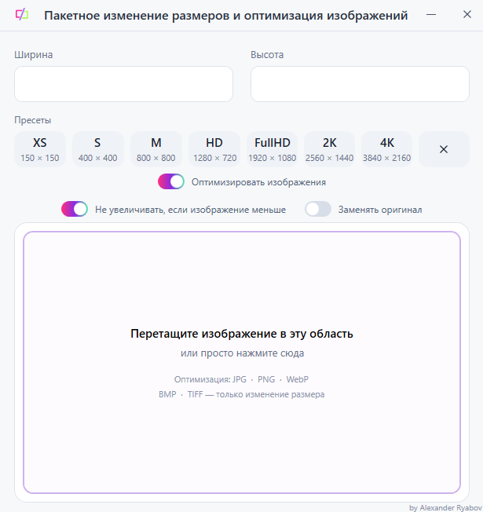

# RResizer

Простой пакетный ресайзер изображений для Windows.

## Возможности

- Пакетное изменение размера изображений
- Сохранение пропорций
- Готовые пресеты: XS, S, M, HD, FullHD, 2K и 4K
- Поддержка Drag & Drop
- Возможность не увеличивать изображения меньшего размера
- Замена оригиналов или сохранение копий
- JPG, PNG, WebP, BMP, TIFF

## Скачать

**Windows x64**

[Скачать RResizer 1.0.0](../../releases/latest)

## Требования

- Windows 10 / 11
- .NET 8 Desktop Runtime